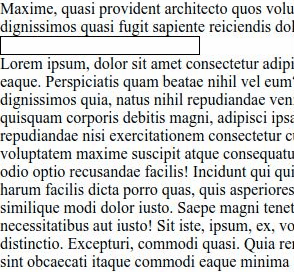

# completo



A minimal, zero-dependency autocomplete implementation for your web projects.

By nature, `completo` is unstyled (headless), and it's up to you to style it.

This project is still young and not yet ready for prime time.

## Installation

### Option A: use [npm](https://www.npmjs.com/package/@destacks/completo)

```sh
npm install @destacks/completo
```

### Option B: use [`degit`](https://github.com/Rich-Harris/degit)

Needs `npm` locally installed.

```sh
npx degit destacks/completo
```

## Run Example

To run the example, you need to serve a JSON file as pseudo-API

### 1. Go to example

- if installed via `npm`:
  ```sh
  cd node_modules/@destacks/completo/example/
  ```
- if installed via `degit`:
  ```sh
  cd example/
  ```

### 2. Install `json-server` dependency

```sh
npm install
```

### 3. Run `json-server` to mock data API

```sh
npm run json-server
```

### 4. Open `index.html`

Open the `index.html` in your `example` folder in a browser (go in your browser of choice and navigate to `index.html` in the `example` folder and open it).

Some people have some HTML serving functionality built-in in their editor or IDE.

For example if you use [`Visual Studio Code`](https://code.visualstudio.com/), you could use [`Live Server`](https://marketplace.visualstudio.com/items?itemName=ritwickdey.LiveServer) to serve the `index.html` in the `example` folder.
